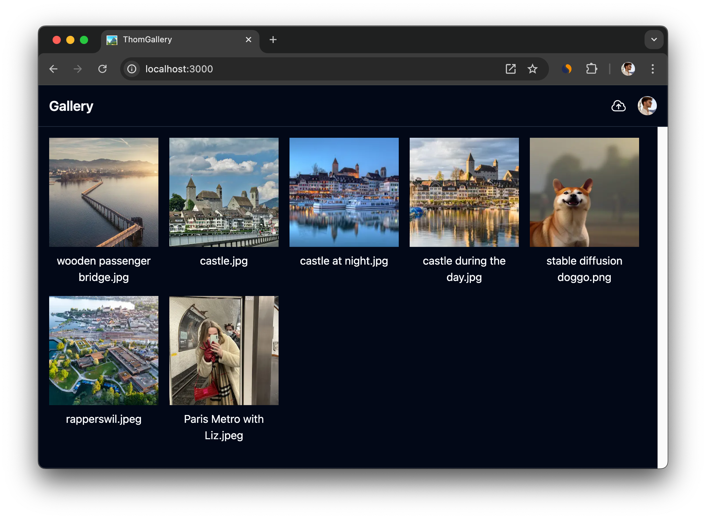

# Gallery

A simple full-stack gallery app built with Next.js, Clerk, UploadThing, and more. The app is deployed on Vercel, utilizing serverless functions, database management, and image storage. I did this project to harden my skills and try out Next.js.

Check it out here: https://gallery-two-roan.vercel.app

## Technologies Used

- **[Next.js](https://nextjs.org/):** React Framework by Vercel. It powers the entire application, enabling server-side rendering, static site generation, and client-side routing.
  - **Parallel Routes:** For handling modal prompts, allowing for non-blocking UI interactions. E.g. clicking on an image will open the image as a modal, but the url will change. This allows users to save a link to the image itself.
  - **Server Components:** Leveraged for implementing server-side logic (such as handling delete actions directly on the server).
  - **Image Component:** For efficient image rescaling (optimizes thumbnails).
- **[Uploadthing](https://uploadthing.com/):** For image storage. Provides a simple interface for uploading and managing images in the gallery.
- **[Vercel](https://vercel.com/):** For deployment.
  - **Vercel Postgres:** Database solution powering e.g. the back-end, storing user data, and images.
- **[ShadUI](https://ui.shadcn.com):** UI component library
- **[Clerk](https://clerk.com):** Authentication solution that handles user sign-up, login, and session management.
- **[PostHog](https://posthog.com/):** Analytics platform used to track user behavior within the app.
- **[Sentry](https://sentry.io/):** For error management and monitoring (faster troubleshooting and bug fixes).
- **[Upstash](https://upstash.com/):** For rate limiting server actions, ensuring the app remains responsive and secure.

## Features

- Image Uploading
- Authentication
- Image Gallery (View images in a responsive grid layout).
- Direct link to image (each image has a unique URL).
- Image Deletion

## TODO

- [x] Make it deploy (vercel)
- [x] Scaffold basic ui with mock data
- [x] Tidy up build process
- [x] Set up Database (vercel postgres)
- [x] Attach Database to UI
- [x] Add Authentication (clerk)
- [x] Add Image upload
- [x] Taint (server-only)
- [x] Use Next/Image component
- [x] Error management (sentry)
- [x] Routing/image page (parallel route)
- [x] Update upload button to be less cringe
- [x] Implement Toasts (shadui)
- [x] Analytics (posthog)
- [x] Delete Button (server actions)
- [x] Ratelimiting (upstash)
